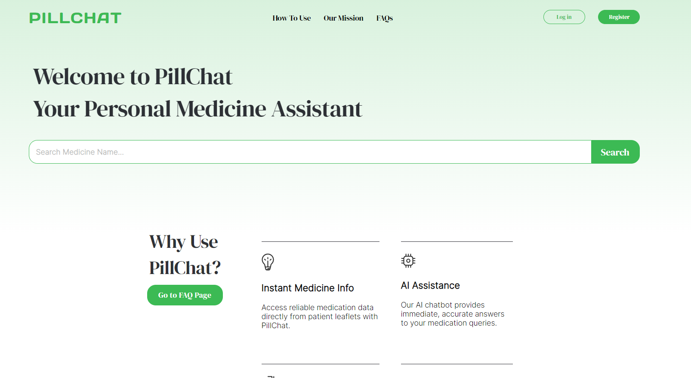

# PillChat

Welcome to PillChat, an innovative web application designed to provide users with reliable and accurate information about their medications. By leveraging the power of chatbot technology and patient information leaflets, PillChat ensures that users can easily access crucial information about their medicines in a conversational manner. Moreover, PillChat supports multilingual queries, making it accessible to users worldwide.

## Features

- **Medicine Information Lookup**: Users can search for their medication by name to access detailed information sourced directly from patient information leaflets.
- **Interactive Chatbot**: Ask any questions related to the medication, and our intelligent chatbot will provide accurate answers.
- **Multilingual Support**: PillChat supports multiple languages, allowing users to ask questions and receive answers in their preferred language.
- **User-Friendly Interface**: Designed with simplicity and ease of use in mind, making medical information accessible to everyone.

## Usage

To use PillChat, simply enter the name of your medication into the search bar. Once you've found your medication, you can start asking the chatbot any questions related to the medicine.

### Example Interaction

1.**Front Page**  
   User-Friendly UI.  
    *Screenshot description: The user enters "Ibuprofen" into the search bar.*
   
2. **Searching for a Medication**  
   Enter the medication name in the search bar.  
    *Screenshot description: The user enters "Ibuprofen" into the search bar.*

3. **Chatting with PillChat**  
   After selecting your medication, you can start a conversation with the PillChat bot regarding your queries.  
    *Screenshot description: The user asks, "What are the side effects of Ibuprofen?" PillChat responds with a list of common side effects.*

### Multilingual Support

PillChat supports questions and answers in multiple languages. Simply ask your question in your preferred language, and PillChat will respond accordingly.

 *Screenshot description: The user asks a question in Spanish, and PillChat provides an answer in Spanish.*

